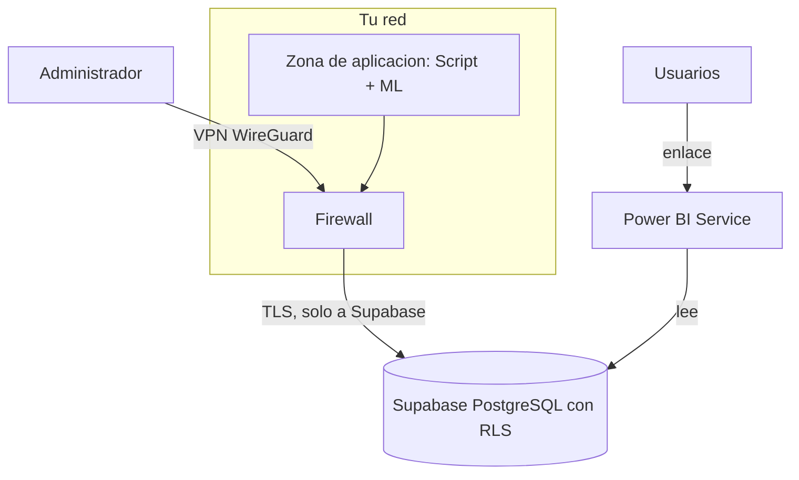

# Diagrama de red

```mermaid
flowchart TD
    ADM[Administrador] -- VPN WireGuard --> FW
    subgraph RED[Tu red]
        APP[Zona de aplicacion: Script + ML] --> FW[Firewall]
    end
    FW -- TLS, solo a Supabase --> SB[(Supabase PostgreSQL con RLS)]
    PBI[Power BI Service] -- lee --> SB
    USR[Usuarios] -- enlace --> PBI
```
